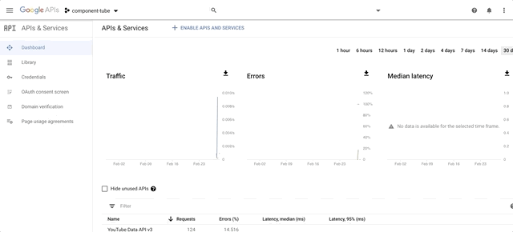
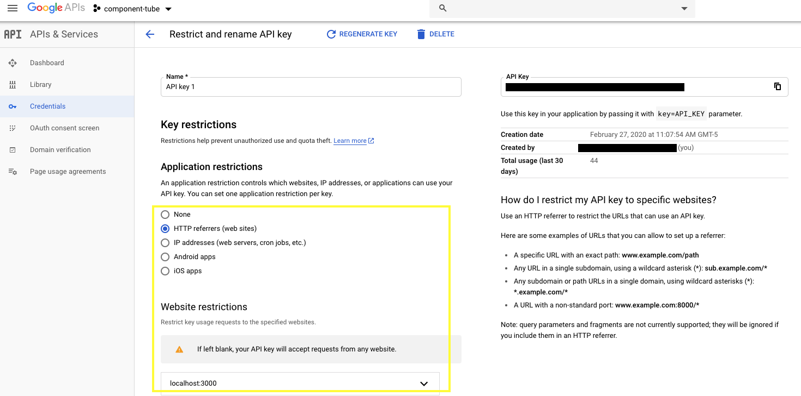

# ComponentTube - React App with use of the YouTube Data API v3

## Deployment
***[ComponentTube - app](http://component-tube.surge.sh/)***

ComponentTube will retrieve a list of 5 videos from YouTube based on your search term using the YouTube Data API. The videos are displayed using a combination of React props, CSS grid, and Javascript event listening.

ComponentTube will retrieve a list of 5 videos based on your video search using the Youtube Data API. 

To run this project please run the following:
* Go into the project: `cd component-tube`
* Install: `npm install`

If you want to build a similar project on your own you will need a console.developers.google account and an API key. You can sign up [here](https://console.developers.google.com/).

* Create Account/Sign in with Google Account
* Create a project
* Click **ENABLE APIS AND SERVICES**
* Find the *YouTube Data API v3*
* Add an API key and now you can copy that into your project in your api/youtube.js file

 

Also make sure you restrict your HTTP response as seen below, allowing only the website you want to make requests to the API.

 

When the youtube.js file is complete `cd component-tube` and enter `npm start` and you are done!

***

## Further Information:
### Components
* *Detail* 
* *ListOfVideos*
* *Video*
* *Search Field*

### API's
* *[Youtube Data API v3](https://developers.google.com/youtube/v3)*

### Available Scripts:

In the project directory, you can run:

* `npm start`

Runs the app in the development mode. 
Open [http://localhost:3000](http://localhost:3000) to view it in the browser.

The page will reload if you make edits. 
You will also see any lint errors in the console.

